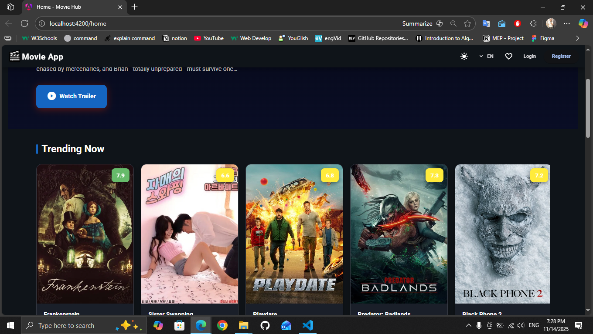
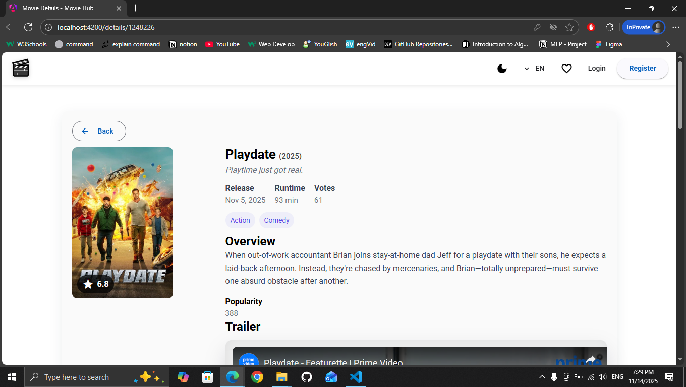
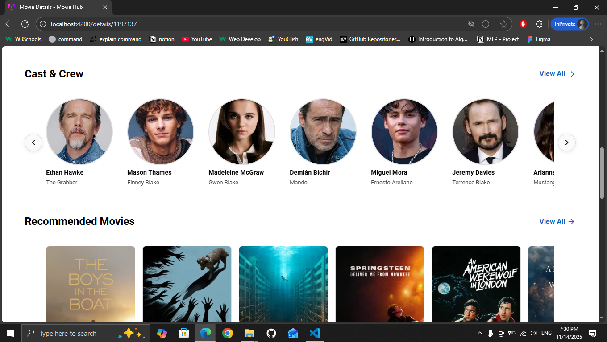
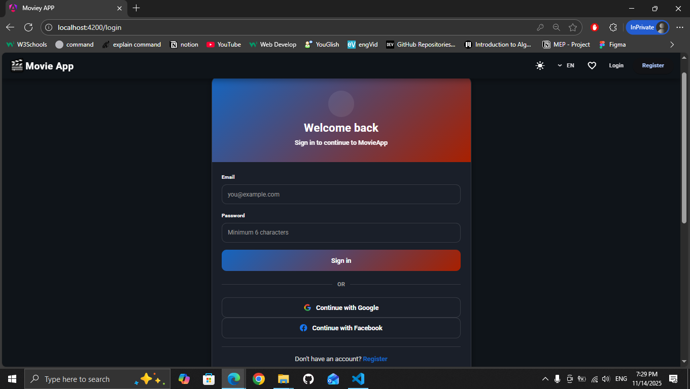

# Movie App (Moviey Watch)

[Live demo](https://heshamasayed.github.io/angular-movie-app/)

---

## Table of Contents

- [Project Overview](#project-overview)
- [Demo Link](#demo-link)
- [Dependencies & Versions](#dependencies--versions)
- [Local Setup Instructions](#local-setup-instructions)
- [Environment Variables](#environment-variables)
- [Features / Functionalities](#features--functionalities)
- [Color System](#color-system)
- [Screenshots](#screenshots)
- [Folder Structure](#folder-structure)
- [Data Models](#data-models)
- [Developers & Supervisor](#developers--supervisor)
- [Dependency Tree (Optional)](#dependency-tree-optional)

---

## Project Overview

Movie App("Moviey Watch") is an Angular-based application that lets users browse movie information (from TMDB), watch trailers, add movies to a personal watchlist (persisted in Firebase), authenticate via Firebase, and explore movie details (cast, recommended, similar movies, providers, videos, etc.). It is designed to be responsive, accessible, and themeable (light/dark).

- Framework: Angular
- Angular version: ^20.x (see `package.json`)
- TypeScript version: ~5.9.x (see `package.json`)
- Angular Material version: ^20.x (see `package.json`)

This README was generated from the repository contents and package manifest in this project.

---

## Demo Link

Try the live demo here:

https://heshamasayed.github.io/angular-movie-app/

---

## Dependencies & Versions

The following dependencies were detected in `package.json` (root). These are the installed packages the app depends on.

### Runtime dependencies (`dependencies`)

- @angular/animations: ^20.3.10
- @angular/cdk: ^20.2.12
- @angular/common: ^20.3.0
- @angular/compiler: ^20.3.0
- @angular/core: ^20.3.0
- @angular/fire: ^20.0.1
- @angular/forms: ^20.3.0
- @angular/material: ^20.2.12
- @angular/platform-browser: ^20.3.0
- @angular/router: ^20.3.0
- bootstrap: ^5.3.8
- firebase: ^12.5.0
- rxjs: ~7.8.0
- tslib: ^2.3.0
- zone.js: ~0.15.0

### Development dependencies (`devDependencies`)

- @angular/build: ^20.3.7
- @angular/cli: ^20.3.7
- @angular/compiler-cli: ^20.3.0
- @types/jasmine: ~5.1.0
- jasmine-core: ~5.9.0
- karma: ~6.4.0
- karma-chrome-launcher: ~3.2.0
- karma-coverage: ~2.2.0
- karma-jasmine: ~5.1.0
- karma-jasmine-html-reporter: ~2.1.0
- typescript: ~5.9.2

> Note: Exact installed versions may differ if `package-lock.json` exists with resolutions; running `npm ci` will install lockfile versions.

---

## Local Setup Instructions

Follow these steps to run the project locally.

1. Prerequisites

- Node.js (recommended v18 or v20 LTS)
- npm (comes with Node.js)
- Angular CLI (optional, but handy): `npm install -g @angular/cli`

2. Install dependencies

```bash
cd path/to/angular-movie-app-master
npm install
```

3. Configure environment (see next section)

4. Run the dev server

```bash
ng serve
# or using npm script
npm start
```

Open http://localhost:4200 in your browser.

5. Build for production

```bash
ng build --configuration production
# or
npm run build
```

6. Run tests

```bash
npm test
```

---

## Environment Variables

The project integrates with two external services:

1. The Movie Database (TMDB) API
2. Firebase (Realtime DB / Authentication / Storage)

Configuration locations:

- `src/environments/environment.ts` (development)
- `src/environments/environment.prod.ts` (production)

Examples found in this repository include a TMDB API key and Firebase configuration directly inside these environment files. Replace them with your own values for security when deploying to public repositories.

Important keys to set:

- TMDB API key: used in `src/app/services/server/api.ts` (the `apiKey` property). Replace the `apiKey` value with your own TMDB key from https://www.themoviedb.org/settings/api

- Firebase config: the `environment.firebase` object should contain your project's `apiKey`, `authDomain`, `projectId`, `storageBucket`, `messagingSenderId`, and `appId`. These are used by `@angular/fire`.

Security note:

- Do not commit production keys to public repositories. For CI / deployments use environment variables or secret managers and replace values at build time (or use a build-time environment file replacement).

---

## Features / Functionalities

- Browse movies: trending, popular, now playing, top rated, upcoming
- Movie details: overview, runtime, release date, genres, videos (trailers), cast & crew
- Search by title with pagination
- Recommendations & similar movies
- Watch providers lookup
- Watchlist: authenticated users can add/remove movies from a personal watchlist (persisted in Firebase)
- Authentication: Firebase Auth (email/password + social providers flows prepared)
- Dark / Light theme toggle with CSS variables and Angular Material theming
- Responsive layout (desktop/tablet/mobile)
- Multi-language support (language passed to TMDB calls)
- Lazy loading of assets and images (project contains a `lazy-load` directive)
- Small UX niceties: autoplay videos component, card hover effects, rating badges

---

## Color System

This project centralizes theme colors in `src/custom-theme.scss`.

- The file defines Angular Material themes (`$light-theme`, `$dark-theme`) and registers them.
- It also defines many CSS custom properties (`--primary-color`, `--card-bg`, `--rating-high`, etc.) inside `:root` and `.dark-mode` for the dark theme.

To change colors quickly:

1. Edit the variables at the top of `src/custom-theme.scss` (or update the `:root` custom properties).
2. Rebuild the app or use the dev server to see changes (`ng serve`).

Examples:

- Change primary color: update `--primary-color` or the `$primary-palette` values in `custom-theme.scss`.
- Toggle dark mode: add/remove the `dark-mode` class on the `body` or root element.

---

## Screenshots

Place screenshot images inside `docs/screenshots/` (create the folder if it doesn't exist). The README references the following files:

- `docs/screenshots/homepage-featured.png` — Homepage / Featured movies section
- `docs/screenshots/movie-details.png` — Movie Details page
- `docs/screenshots/login.png` — Login page

Example markdown to include images (already used below):


*Homepage — Featured movies.*



*Movie Details page with cast & recommended movies.*


*Login / Sign-in screen.*

> Note: The repository contains screenshots you can copy into the `docs/screenshots/` folder. If you prefer a different location, update the paths accordingly.

---

## Folder Structure

Top-level source structure (important files & folders):

```
src/
  app/
    components/        # UI components (home, details, login, register, watch-list, etc.)
    directives/        # custom directives (e.g., lazy-load)
    guards/            # route guards (e.g., auth.guard.ts)
    models/            # data model types (user, watchlist item, etc.)
    services/          # API, auth, watchlist, display services
    app.ts, app.routes.ts, app.config.ts
  assets/               # static files (images, videos)
  environments/         # environment.ts / environment.prod.ts
  main.ts
  index.html
  styles.css
custom-theme.scss       # project-level theming (Angular Material + CSS vars)
```

---

## Data Models

The repository defines a `User` model in `src/app/models/user.model.ts`. Key structures:

### User

```ts
export interface User {
  uid?: string;
  name: string;
  email: string;
  phone: string | null;
  country: string | null;
  city: string | null;
  profileImage: string | null;
  watchlist: WatchlistItem[] | null;
  createdAt: number;
  lastLogin?: number;
}
```

### WatchlistItem

```ts
export interface WatchlistItem {
  movieId: string;
  title: string;
  poster: string;
  addedAt: number;
  releaseDate: string;
  rating: number;
}
```

### Movie object (TMDB)

Movie objects in this app come from The Movie Database (TMDB) API. Typical relevant fields used across the app:

- `id` (number)
- `title` / `name` (string)
- `overview` (string)
- `release_date` (string)
- `runtime` (number)
- `poster_path` / `backdrop_path` (string) — combined with TMDB base image URL
- `genres` (array)
- `vote_average` (number)
- `vote_count` (number)
- `popularity` (number)
- `videos` (object) — trailers & clips
- `credits` (object) — cast & crew
- `recommendations` / `similar` (arrays)

The API service `src/app/services/server/api.ts` contains helper methods that return these combined responses (for example `getMovieByIdWithVideos` or `getMovieFullDetailsWithAppend`).

---

## 👥 Development Team

### Developers

**[Mohamed Galal](https://github.com/MohamedGll), [Mohamed Nasser](https://github.com/Mohammed20367), [Ahmed Fawzy](https://github.com/ahmed-fawzy2000), [Andrew Nassim](https://github.com/andrew-nassim), [Hesham Ahmed](https://github.com/heshamAsayed)**

### Supervisor

**[Hassan Eldash](https://github.com/hassaneldash)**

---

## Dependency Tree (Optional)

A simplified dependency map of major libraries used by the app:

```
Angular (core @angular/* v20)
├─ @angular/platform-browser
├─ @angular/router
├─ @angular/forms
├─ @angular/animations
├─ RxJS (~7.8)
├─ Zone.js (~0.15)
└─ Angular Material (@angular/material v20)
   ├─ Angular CDK (@angular/cdk v20)
   └─ Material theming utilities

Other major integrations:
├─ @angular/fire -> Firebase SDK (firebase v12)
└─ Bootstrap (v5) for some responsive helpers
```

---

## Notes & Next Steps

- Security: rotate or remove API keys before publishing to public repos. Prefer environment injection (CI secrets, `.env` replacement at build time, or Angular file replacements with non-committed files).
- If you want, I can:
  - Create a `.env.example` and update `environment.ts` to read from it (with an appropriate build adjustment)
  - Add a GitHub Actions workflow to build and deploy to GitHub Pages (the repo already has a `gh-pages` branch)
  - Add a quick `CONTRIBUTING.md` with developer setup instructions

---


